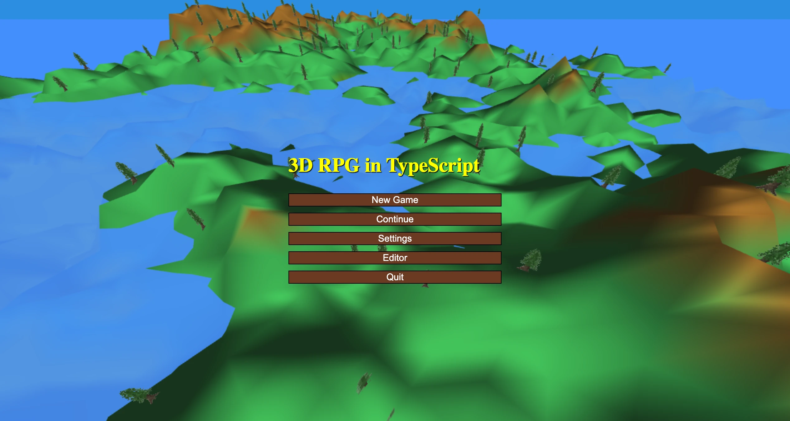
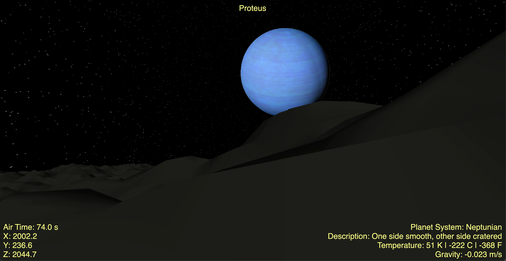

# Spindle

Spindle is a game engine written in TypeScript for Browser. 




## Background

Spindle is the game engine which powers a handful of my own projects, including
a few games published on YouTube. 

- [3D RPG Tutorial](https://github.com/AlexanderFarrell/3d-rpg-in-typescript) -
  3D RPG with YouTube Tutorials
- [Walk on Planets Remake](https://github.com/AlexanderFarrell/walk-on-planets-remake) -
  Simulates walking on Mars, Mercury, Venus, Titan, Proteus, Io, etc with physics.

## Quick Start

This repo includes a script you can run to scaffold a new project with Spindle.
Run the following to create a new project:

### MacOS / Linux / BSD

```sh
# MacOS / Linux / FreeBSD
curl -O https://raw.githubusercontent.com/AlexanderFarrell/spindle/master/create-spindle-game.sh
chmod +x create-spindle-game.sh
./create-spindle-game.sh my-game
```

Or specify a specific version of Spindle (recommended). See [tags](https://github.com/AlexanderFarrell/spindle/tags) for each version.

```sh
./create-spindle-game.sh my-game --tag v1.0.0
```

Then run the following to begin working

```sh
cd my-game
npm install  # Installs dependencies
npm run dev  # Runs the game with hot reloading
```

### Windows (With Powershell)

```pwsh
Invoke-WebRequest -Uri https://raw.githubusercontent.com/AlexanderFarrell/spindle/master/create-spindle-game.ps1 -OutFile create-spindle-game.ps1
.\create-spindle-game.ps1 my-game
```

Or specify a specific version of Spindle (recommended). See [tags](https://github.com/AlexanderFarrell/spindle/tags) for each version.

```pwsh
.\create-spindle-game.ps1 my-game -Tag v1.0.0
```

Then run the following to begin working

```sh
cd my-game
npm install  # Installs dependencies
npm run dev  # Runs the game with hot reloading
```

## Manual Initialization

My preferred way to add Spindle is to add it as a submodule, then use npm workspaces. See
[Walk on Planets Remake](https://github.com/AlexanderFarrell/walk-on-planets-remake) for
an example of how this is done.

1. Initialize git in your project if you haven't already with `git init`.
2. Create a folder for your game or app code.
3. Make a submodule of this project with `git submodule add https://github.com/AlexanderFarrell/spindle spindle`
4. Change directory into it with `cd spindle`
5. Pick the version of Spindle you want by choosing a tag at `https://github.com/AlexanderFarrell/spindle/tags`
   - For example, to check out v1.0, do `git checkout v1.0`
6. Make a package.json file at the root of the project, and specify workspaces for your game and spindle. See
   [this example package.json](https://github.com/AlexanderFarrell/walk-on-planets-remake/blob/master/package.json)
   which also includes scripts to conveniently run things at the root directory of your project.
7. Bring in Spindle to your project in your package.json, see 
   [this example of a game's package.json](https://github.com/AlexanderFarrell/walk-on-planets-remake/blob/master/game/package.json)
   note where it says `"engine": "file:../spindle"` under dependencies.
8. Ensure your root tsconfig.json points to your projects, see
   [this example](https://github.com/AlexanderFarrell/walk-on-planets-remake/blob/master/tsconfig.json)
9. Ensure your root tsconfig.base.json is configured, see 
   [this example](https://github.com/AlexanderFarrell/walk-on-planets-remake/blob/master/tsconfig.base.json)
10. Ensure your game's tsconfig.json is configured, see
   [this example](https://github.com/AlexanderFarrell/walk-on-planets-remake/blob/master/game/tsconfig.json)
11. I like to use vite, but webpack works as well. See 
   [this example package.json](https://github.com/AlexanderFarrell/walk-on-planets-remake/blob/master/package.json)
   and place this [vite.config.ts](https://github.com/AlexanderFarrell/walk-on-planets-remake/blob/master/game/vite.config.ts)
   inside your games folder.
12. If you use vite, load game assets with this `assets.d.ts` file. See
    [assets.d.ts](https://github.com/AlexanderFarrell/walk-on-planets-remake/blob/master/game/assets.d.ts)
13. Run `npm install` at the root
14. Run `npm start` to play